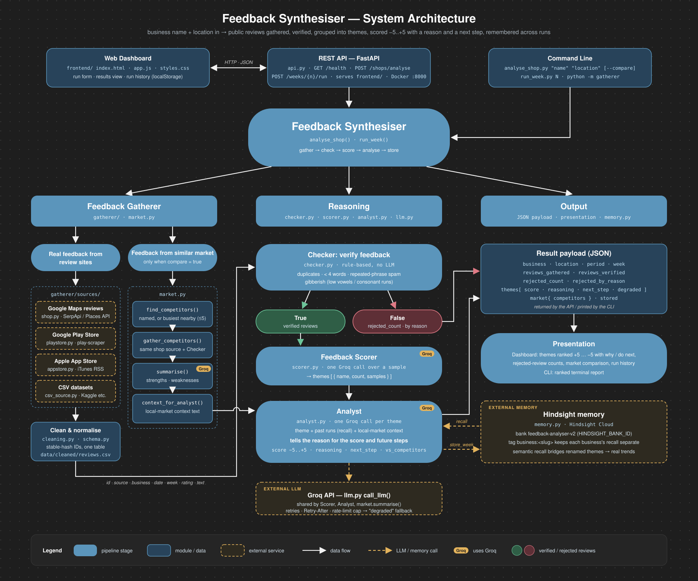

# Feedback Analyser

Give it a business name and a location. It scrapes that business's public
reviews, throws away the junk, groups what's left into themes, and scores each
theme from **−5 to +5** with a reason and a concrete next step — so an owner
sees *what to fix first* and *what not to break*, not just a star rating.

It also remembers. Every run is stored, so the next one can say *"crowding was
flagged 10 times last month, 5 this month"* instead of restating one batch.

```
$ python analyse_shop.py "Niloufer Cafe" "Hitech City"

  +5   Excellent tea and bun maska   (12 mentions)
       why   All 12 mentions praise the chai and bun maska as the highlight,
             describing them as the best they've had. This is the single
             biggest strength right now.
       do    Continue preparing the Irani tea and bun maska exactly as they
             are — same recipes, sourcing, and preparation.

  -4   Overpriced / hype   (13 mentions)
       why   Thirteen customers called the pricing too high, with chai at
             ₹150–250 and repeated "not worth the hype" comments...
       do    Introduce value bundles (tea + bun combo) and communicate them
             in-store, then monitor price perception.
```

---

## How it works



Five stages. Each one hands the next a plain list of dicts, so any stage can be
swapped without touching the others.

```
  name + location
        │
        ▼
 ┌─────────────┐   Google Maps / Play Store / App Store / Kaggle CSV
 │  GATHERER   │   → one normalised table, written to data/cleaned/reviews.csv
 └─────────────┘
        │  id, source, origin, business, date, week, rating, text, …
        ▼
 ┌─────────────┐   rule-based, no LLM: duplicates, <4 words,
 │   CHECKER   │   repeated-phrase spam, gibberish
 └─────────────┘
        │  verified reviews + a rejected count
        ▼
 ┌─────────────┐   one Groq call: reads a sample, returns recurring
 │   SCORER    │   themes with a name, mention count and quotes
 └─────────────┘
        │  [{name, count, samples}]
        ▼
 ┌─────────────┐   one Groq call per theme, plus recall of past runs
 │   ANALYST   │   → score −5..+5, reasoning, next_step
 └─────────────┘
        │
        ▼
 ┌─────────────┐   stores this run so the next one can spot trends
 │  HINDSIGHT  │
 └─────────────┘
```

| Stage | File | What it does |
|---|---|---|
| Gatherer | `backend/gatherer/` | Pulls reviews from a shop (Google Maps), an app (Play/App Store) or a CSV into one table |
| Checker | `backend/checker.py` | Rule-based filter. No LLM — deterministic and free |
| Scorer | `backend/scorer.py` | Groq groups reviews into themes with counts and quotes |
| Analyst | `backend/analyst.py` | Groq scores each theme −5..+5 with reasoning, using past runs |
| Memory | `backend/memory.py` | Hindsight Cloud — semantic recall across runs |
| API | `backend/api.py` | FastAPI wrapper for the mobile app |

### The −5..+5 scale

A plain sentiment score doesn't tell an owner what to do on Monday. This one is
a triage queue:

| Score | Meaning |
|---|---|
| **+5** | The single best thing. Don't change it |
| +1..+4 | Real strengths, ranked by how much they matter |
| −1..−4 | Real problems, ranked by urgency |
| **−5** | Fix this before anything else |

### Why memory matters

Themes get reworded between runs — "Pricing and Affordability" one month,
"pricing reasonableness" the next. Hindsight's recall is semantic, so it bridges
the rename and the Analyst still cites the earlier figure. That's the difference
between a monthly snapshot and an actual trend.

---

## Setup

Needs Python 3.12+.

```bash
git clone https://github.com/KrispLabs/Feedback-Analyser.git
cd Feedback-Analyser/backend
python -m venv .venv && source .venv/bin/activate
pip install -r requirements.txt
```

Copy `.env.example` to `.env` in the repo root and fill it in:

```ini
GROQ_API_KEY=          # required — console.groq.com
HINDSIGHT_API_KEY=     # required — hindsight.vectorize.io
SERPAPI_API_KEY=       # for shop reviews — serpapi.com (250 free searches/month)
GOOGLE_MAPS_API_KEY=   # alternative to SerpApi (capped at 5 reviews per shop)
```

`.env` is gitignored — never commit it. For local CLI runs, export it first:

```bash
set -a && . ../.env && set +a
```

Docker picks `.env` up on its own:

```bash
docker compose up        # serves the API on :8000
```

> **macOS note:** a bare venv ships no root certificates, so every HTTPS source
> fails with `CERTIFICATE_VERIFY_FAILED`. Fix once with
> `pip install certifi && export SSL_CERT_FILE=$(python -c "import certifi;print(certifi.where())")`,
> or just use Docker.

---

## Usage

### Analyse a business by name and location

```bash
python analyse_shop.py                                   # prompts for both
python analyse_shop.py "Niloufer Cafe" "Hitech City"
python analyse_shop.py "Niloufer Cafe" "Hitech City" --limit 200 --months 6
```

| Flag | Default | What it does |
|---|---|---|
| `--limit N` | `400` | Analyse the newest N reviews **with text** |
| `--months N` | `0` | Also skip reviews older than N months. `0` = no age limit |
| `--provider` | `serpapi` | `serpapi` (hundreds of reviews) or `places` (Google's own API, max 5) |
| `--max-pages N` | `30` | Ceiling on billable SerpApi searches, so one run can't drain your quota |
| `--run N` | `1` | Numbers this run so later runs compare against it |
| `--no-store` | off | Don't write to Hindsight |
| `--compare` | off | Also analyse the 3 busiest similar places nearby (the local market) |
| `--competitor NAME` | — | A competitor to compare with, repeatable; implies `--compare` |

Each business should get its own Hindsight bank, or a cafe's themes pollute a
telecom's recall:

```bash
HINDSIGHT_BANK_ID=niloufer-cafe python analyse_shop.py "Niloufer Cafe" "Hitech City"
```

### Just gather, without analysing

```bash
python -m gatherer shop "Niloufer Cafe" "Hitech City" --since 2026-07-01
python -m gatherer --config gatherer_config.json          # apps + CSV datasets
python run_week.py 2                                      # analyse one ISO week
python run_week.py --weeks                                # list available weeks
```

Gathered reviews append to `data/cleaned/reviews.csv`. Review IDs are stable
hashes, so re-gathering the same business updates rows instead of duplicating.

---

## API — for the frontend

```bash
cd backend && uvicorn api:app --host 0.0.0.0 --port 8000
# or: docker compose up
```

Interactive docs are generated automatically at **`/docs`** (Swagger) and
**`/redoc`** — those are always current, so trust them over this file if they
ever disagree.

### `GET /health`

Liveness check. Hits no external service.

```json
{ "status": "ok", "bank_id": "feedback-analyser-v2", "sample_size": 50 }
```

### `POST /shops/analyse` — the main flow

Body:

| Field | Type | Default | Notes |
|---|---|---|---|
| `name` | string | *required* | `"Niloufer Cafe"` |
| `location` | string | `""` | `"Hitech City, Hyderabad"` |
| `limit` | int | `400` | Analyse the newest N reviews with text. 1–1000 |
| `months` | int | `0` | Also skip reviews older than N months. `0` = no age limit. Max 120 |
| `provider` | string | `"serpapi"` | `"serpapi"` or `"places"` |
| `store` | bool | `true` | Write to Hindsight for trend recall |
| `run_number` | int | `1` | Later runs compare against earlier ones |
| `compare` | bool | `false` | Also read nearby competitors' reviews, and score each theme against the local market |
| `competitors` | string[] | `[]` | Competitors to compare with (max 5), e.g. `["Chai Point", "Cafe Bahar, Basheerbagh"]`. A name with a comma is searched as given; otherwise `location` is added. Implies `compare`. Empty = find the busiest similar places nearby |
| `competitor_count` | int | `3` | How many nearby competitors to find when none are named. 1–5 |

```bash
curl -X POST http://localhost:8000/shops/analyse \
  -H 'Content-Type: application/json' \
  -d '{"name":"Niloufer Cafe","location":"Hitech City"}'
```

**`200`** — the whole dashboard payload:

```json
{
  "week": 3,
  "business": "Niloufer Cafe",
  "location": "Hitech City",
  "period": "2026-07-18 to 2026-09-28",
  "reviews_gathered": 400,
  "reviews_verified": 390,
  "rejected_count": 10,
  "rejected_by_reason": { "too_short": 10 },
  "themes": [
    {
      "name": "Excellent tea and bun maska",
      "count": 12,
      "score": 5,
      "samples": [
        "Absolutely loved this place! The chai and bun maska were easily the highlight...",
        "A legendary spot for a proper Irani tea and bun maska...",
        "Good tea... Tasty maskabun."
      ],
      "reasoning": "All 12 mentions in the period specifically praise the chai and bun maska as the highlight of the cafe... indicating the single biggest strength right now.",
      "next_step": "Continue preparing the Irani tea and bun maska exactly as they are — maintain the same recipes, sourcing and preparation methods.",
      "vs_competitors": "Cafe Bahar's reviews praise its biryani, not its tea, so this is what sets Niloufer apart nearby.",
      "degraded": false
    }
  ],
  "market": {
    "discovered": true,
    "competitors": [
      {
        "name": "Cafe Bahar",
        "address": "Basheerbagh, Hyderabad",
        "rating": 4.2,
        "review_count": 5400,
        "reviews_used": 58,
        "strengths": [{ "point": "Generous biryani portions", "evidence": "Biryani is huge and tasty" }],
        "weaknesses": [{ "point": "Long waits at dinner", "evidence": "Waited 40 minutes for a table" }],
        "degraded": false
      }
    ]
  },
  "stored": true,
  "warnings": []
}
```

With `compare` on, the run finds competitors (one SerpApi search, busiest
first; places sharing the business's name are skipped as other branches),
reads up to 60 of each one's newest reviews through the Checker, and makes
**one** Groq call for every competitor's strengths and weaknesses. The Analyst
gets that summary with every theme, so its `reasoning`, `next_step` and
`vs_competitors` can weigh the theme against the local market. Competitor
reviews are never mixed into the business's own themes. Finding competitors
nearby needs `provider: "serpapi"`; with `places`, name them in `competitors`.

### `POST /weeks/{week_number}/run`

Same payload shape, but for one ISO week of one business's gathered reviews.
Optional query param `?business=Telco` (defaults to the `business` in
`backend/gatherer_config.json`). `week_number` is 1-indexed into the weeks that
business has reviews for (1 = earliest). Only its own reviews are analysed;
competitor (`origin=market`) rows are never mixed in. With `?compare=true`,
that week's market rows (the `market` sources in `gatherer_config.json`) are
summarised into `market` as above, and the Analyst scores against them. Used for the
weekly-trend view rather than one-off lookups. `location` is absent here.

Hindsight memory is scoped per business too: a run only recalls that
business's past runs (shops are keyed by name + location).

### Response fields

| Field | Type | UI hint |
|---|---|---|
| `business`, `location` | string | Header |
| `period` | string | `"2026-07-18 to 2026-09-28"` — show it, the scores only describe this window |
| `rejected_count` | int | "10 reviews filtered out" |
| `reviews_gathered` | int | Reviews with text fetched. Below `limit` means the shop has no more (or `months` cut it off) |
| `reviews_verified` | int | Of those, how many passed the Checker |
| `rejected_by_reason` | object | `{"too_short": 10}` — keys are `too_short`, `duplicate`, `repeated_phrase`, `gibberish`, `empty` |
| `themes[].name` | string | Card title |
| `themes[].count` | int | How many reviews mention it |
| `themes[].score` | int | **−5..+5.** Sort ascending: worst first |
| `themes[].samples` | string[] | 1–3 real quotes. Good for an expandable card |
| `themes[].reasoning` | string | Why this score. A paragraph |
| `themes[].next_step` | string | What to do. A paragraph |
| `warnings` | string[] | Non-fatal problems: review fetching stopped early, Hindsight down, themes that couldn't be scored. Show them as a banner; the result is still usable |
| `stored` | bool | `true` only if Hindsight actually kept this run (false when `store` was off, Hindsight failed, or no theme was really scored) |
| `themes[].degraded` | bool | `true` = not a real score (Groq unavailable or an unusable reply); its `0` is a placeholder |
| `themes[].vs_competitors` | string | How the theme compares with the local market. `""` without `compare`, or when no competitor relates to it |
| `market` | object \| null | `null` without `compare`. `competitors[]`: `name`, `address`, `rating`, `review_count`, `reviews_used`, `strengths[]` / `weaknesses[]` (`point`, `evidence` quote), `degraded` (`true` = Groq didn't summarise it). `discovered`: found nearby rather than named |

`themes` comes back unsorted — sort by `score` in the client. Split at zero for
a two-column "Fix these / Protect these" layout.

### Errors

Every error is JSON: `{"detail": "<human-readable reason>", "error": "<kind>"}`.

| Status | `error` | Meaning | What to show |
|---|---|---|---|
| `404` | `NothingToAnalyse` | Business not found, or every review was filtered out | "Couldn't find reviews for that business — try adding the city" |
| `422` | — | Bad request body (e.g. `months: 999`, empty `name`) | Field validation. `detail[0].msg` has the reason |
| `502` | `UpstreamError` | SerpApi / Places / Groq failed, or a rate limit | "Couldn't analyse right now, try again shortly" — retriable |
| `503` | `ConfigError` | The server is missing an API key | "Service unavailable" — not retriable until the server is fixed |
| `500` | `InternalError` | A bug | Generic error; the server log has the traceback |

Hindsight being down is **not** an error: the analysis runs without past-run
trends and says so in `warnings`.

### ⚠ These endpoints are slow — plan for it

**60–120 seconds is normal**, and the request is synchronous. It scrapes
reviews, then makes one Groq call *per theme*. A measured run took 27s for 6
themes; a bigger one took 89s.

For a mobile client:

- **Set the client timeout to at least 180s.** The default 30–60s will abort a
  perfectly healthy request.
- **Show real progress**, not a spinner — "Finding reviews… / Filtering… /
  Scoring themes…" — or it reads as frozen.
- **Don't fire it on every keystroke.** One call per explicit search.
- **Cache by `(name, location, limit, months)`.** Re-running the same business costs
  real money in Groq tokens and SerpApi searches.

If this becomes a problem, the fix is a job queue: `POST` returns a job id
immediately and the client polls. Not built yet.

### CORS

Currently `allow_origins=["*"]` to unblock local development. **Tighten it to
the real frontend origin before shipping** (`backend/api.py`).

---

## Dashboard — `frontend/`

The API serves the dashboard at its root, so once it is running just open
**http://localhost:8000/** (same origin, no CORS setup). It is plain HTML, CSS
and JS with no build step. `docker compose up` mounts it too.

- **Business lookup** calls `POST /shops/analyse`; **Gathered weeks** calls
  `POST /weeks/{n}/run`. `GET /health` drives the API status chip in the nav.
- Themes come back sorted worst first and split into *Fix these* / *Protect
  these*. A `degraded` theme is flagged *not scored* instead of shown as a real
  0, and `warnings` appear as a banner above the briefing.
- Every result is saved in the browser (`localStorage`), per business. That
  gives the run timeline, run-over-run comparison and the next `run_number`
  without re-spending quota. It only knows runs made from that browser;
  Hindsight still recalls runs made from the CLI.
- *Ask about this run* answers from the result on screen. It makes no API call.
- Progress during a run is estimated from typical timings, since the API has
  no progress endpoint.
- *Preview with example data* loads a fictional café in the exact response
  shape, for trying the UI without keys. It is never saved.
- To point the page at an API on another address, add `?api=http://host:8000`.

---

## Cost and limits

Every run spends real quota, on three services:

| Service | Free tier | Per run |
|---|---|---|
| Groq | 200,000 tokens/day | 1 call for themes + 1 per theme (~7–9 total), +1 for competitors with `compare` |
| SerpApi | 250 searches/month | ~1 search per 20 reviews: up to 30 for the default 400 (fewer for small shops). `compare` adds up to 13: 1 to find competitors + at most 4 per competitor |
| Hindsight | — | 1 store + 1 recall per theme |

Guards already in place: `--max-pages` caps SerpApi searches per run; `--limit`
stops paginating once enough reviews are in, and `--months` once they fall
outside the window; API keys are checked *before* any paid call; the Checker is
pure rules so filtering costs nothing; and the Scorer reads a random *sample* of
50 verified reviews to find themes, so `themes[].count` is a count within that
sample, not across all of them.

At the 400-review default a busy shop can use 30 SerpApi searches, about 8 runs
on the free tier. Pass a smaller `limit` (200 ≈ 11 searches) to stretch it.

**If Groq's daily quota runs out**, the Analyst returns `score: 0` with
`reasoning: "LLM unavailable, defaulted to neutral."` and `degraded: true`. The
HTTP call still succeeds with a `200`. The CLI flags these as `⚠ NOT A REAL
SCORE` — a client should check `degraded` rather than render six confident
zeros. Degraded themes are never stored in Hindsight, so they can't resurface
as a "past trend" on the next run.

---

## Repo layout

```
backend/
  analyse_shop.py      name + location → full analysis (CLI and API entry point)
  run_week.py          same pipeline over one ISO week
  api.py               FastAPI wrapper
  gatherer/
    gatherer.py        orchestrates sources → one cleaned CSV
    schema.py          the row format every source normalises into
    cleaning.py        text/date/rating normalisation, stable IDs
    sources/
      shop.py          Google Maps via SerpApi or Google Places
      playstore.py     Google Play
      appstore.py      Apple RSS
      csv_source.py    Kaggle / offline datasets
  checker.py           rule-based filter
  scorer.py            LLM theme discovery
  analyst.py           LLM scoring + reasoning
  market.py            similar-market scan: find competitors, summarise their reviews
  memory.py            Hindsight store / recall
  llm.py               shared Groq helper: retries, rate-limit backoff, fallbacks
  config.py            key loading (env → keys.csv)
frontend/              dashboard served by api.py at /
data/cleaned/          gathered reviews (gitignored)
NOTES.md               engineering log: decisions, bugs found, what's verified
```

`NOTES.md` is the detailed working record — every bug found against real data
and how it was fixed. Worth reading before changing any stage.
